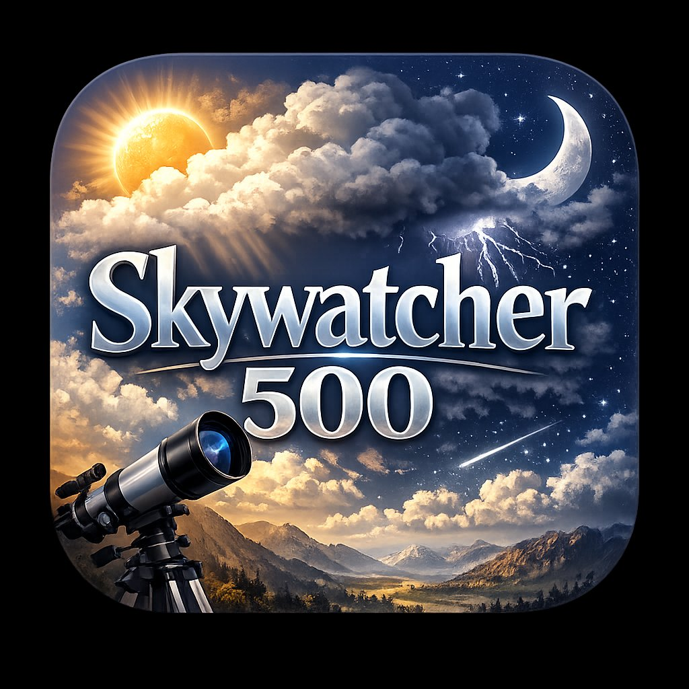

# 🌤 Skywatcher 500 — Family Weather Station

A beautiful, single-file web dashboard for the **Ambient Weather WS-2902** personal weather station. Displays live conditions, a 5-day forecast, hourly temperature chart, and a side-by-side comparison between your local station and any forecast provider.



---

## ✨ Features

- **Live station data** — temperature, humidity, wind, pressure, UV index, solar radiation, rain rate, dew point, indoor sensor, and chicken coop sensor
- **Animated backgrounds** — Ken Burns-effect photos that match current weather conditions across 6 themes (Golf, Beach, Mountains, Farm, City, Forest)
- **Weather particles** — animated rain, snow, and lightning that respond to real conditions
- **Forecast integration** — choose from three providers:
  - ☁️ **OpenWeatherMap** — free tier, 1,000 calls/day
  - 🇺🇸 **Weather.gov (NWS)** — completely free, no API key required (US only)
  - 🌐 **WeatherAPI.com** — free tier, 1,000,000 calls/month
- **Station vs Forecast comparison** — color-coded delta table showing where your WS-2902 differs from the official forecast
- **5-day forecast strip** + **24-hour temperature bar chart** on the main page
- **°F / °C toggle** — updates all values including forecast
- **Scrollable main page** — station stats on top, full forecast below
- **Setup panel** — configure API keys, custom Unsplash background photos, and station settings without editing code
- **Single HTML file** — no build tools, no dependencies, no server required

---

## 🚀 Quick Start

### Option 1 — Open locally
1. Download `index.html`
2. Open it in any modern browser (`Chrome`, `Firefox`, `Edge`, `Safari`)
3. Done — it works offline with demo data

### Option 2 — GitHub Pages
1. Fork this repository
2. Go to **Settings → Pages → Source → Deploy from branch → `main` → `/root`**
3. Your dashboard will be live at `https://yourusername.github.io/skywatcher500/`

---

## 🔌 Connecting Your WS-2902

1. Click the **⚙️ gear button** (bottom-right corner)
2. Go to **🔌 API & Station** tab
3. Enter your **Ambient Weather Application Key** and **API Key**
   - Get these from [ambientweather.net](https://ambientweather.net) → My Account → API Keys
4. Set your **Chicken Coop Sensor Field** (usually `temp1f`)
5. Click **💾 Save All Changes**
6. Uncomment the production API block at the bottom of `index.html` (clearly marked)

---

## 🌤 Connecting a Forecast Provider

1. Click **⚙️ Setup → 🌤 Forecast**
2. Choose your provider tab

### Weather.gov (Recommended — Free, No Key)
1. Select **🇺🇸 Weather.gov**
2. Enter your **latitude and longitude** (default: Plant City, FL `28.0025, -82.1220`)
3. Click **Detect Grid** — auto-configures your NWS grid point
4. Click **💾 Save & Fetch**

### OpenWeatherMap
1. Sign up at [openweathermap.org](https://openweathermap.org/api)
2. Subscribe to **Current Weather + Forecast** (free tier)
3. Paste your API key into the **OWM API Key** field
4. Enter your lat/lon
5. Click **💾 Save & Fetch**
> ⚠️ New API keys can take up to 2 hours to activate after signup.

### WeatherAPI.com
1. Sign up at [weatherapi.com](https://weatherapi.com)
2. Copy your API key from the Dashboard
3. Enter your key and city name or lat,lon
4. Click **💾 Save & Fetch**

---

## 🎨 Customizing Background Photos

1. Open **⚙️ Setup → any theme tab** (Golf, Beach, Mountains, etc.)
2. For each weather condition, paste an [Unsplash](https://unsplash.com) photo URL
3. Click **Apply** or **💾 Save All Changes**

Supports both Unsplash page URLs (`unsplash.com/photos/...`) and direct image URLs.

---

## 📁 File Structure

```
skywatcher500/
├── index.html        # The entire app — self-contained single file
├── skywatcher.ico    # App icon (500px, multi-resolution)
├── icon.png          # App icon (PNG for README and web manifest)
└── README.md         # This file
```

---

## 🛠 Tech Stack

- **Vanilla HTML/CSS/JavaScript** — zero frameworks, zero build steps
- **Google Fonts** — Playfair Display, DM Sans, DM Mono
- **Unsplash** — background photography
- **APIs** — Ambient Weather, OpenWeatherMap, Weather.gov, WeatherAPI.com
- **localStorage** — persists all settings and API keys locally in your browser

---

## 🗺 Roadmap

- [ ] Activate live WS-2902 data (uncomment production API block)
- [ ] Wind speed history graph
- [ ] Alerts / severe weather warnings (NWS alerts API)
- [ ] Dark/light mode toggle
- [ ] PWA / installable app manifest
- [ ] Export data to CSV

---

## 📄 License

MIT License — free to use, modify, and distribute.

---

*Built with ❤️ for the Skywatcher 500 family weather station.*
